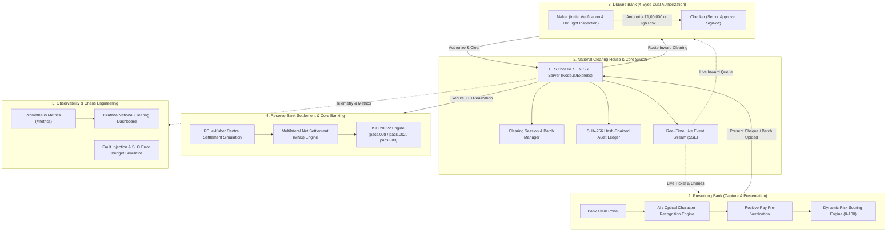

# 🏦 CTS — Enterprise Cheque Truncation & SRE Clearing Platform

[](https://github.com/rushi-7388/cts-system/actions/workflows/ci.yml)
[](https://nodejs.org/)
[](https://reactjs.org/)
[](https://vitejs.dev/)
[](https://tailwindcss.com/)
[](https://www.prisma.io/)
[](https://www.postgresql.org/)
[](https://www.docker.com/)
[](https://kubernetes.io/)
[](https://prometheus.io/)
[](https://grafana.com/)
[](LICENSE)

An industry-grade, full-stack simulation of an interbank **Cheque Truncation System (CTS)** conforming to **NPCI CTS-2010 Standards**, the **RBI Continuous Clearing & On-Realisation Directive**, and **ISO 20022 Financial Messaging**. 

The platform integrates enterprise banking governance (**Maker-Checker 4-Eyes Principle**, **Positive Pay System**, **Cryptographic SHA-256 Ledger**) with cloud-native reliability engineering (**Site Reliability Engineering (SRE) SLOs**, **Chaos Engineering Fault Simulator**, **Prometheus & Grafana Observability**, **Automated Database DevOps**, and **Kubernetes Cloud-Native Orchestration**).

---

## 📑 Table of Contents

- [System Architecture](#-system-architecture)
- [Unique Enterprise & Fintech Features](#-unique-enterprise--fintech-features)
- [SRE, DevOps & Cloud-Native Observability](#-sre-devops--cloud-native-observability)
- [Tech Stack](#-tech-stack)
- [Quick Start with Docker Compose](#-quick-start-with-docker-compose)
- [Local Development Setup (Non-Docker)](#-local-development-setup-non-docker)
- [Demo Accounts & Test Credentials](#-demo-accounts--test-credentials)
- [Interactive Testing & Evaluation Scenarios](#-interactive-testing--evaluation-scenarios)
- [API Reference & Real-Time Endpoints](#-api-reference--real-time-endpoints)
- [Database Reliability & DevOps Toolkit](#-database-reliability--devops-toolkit)
- [Kubernetes Production Deployment](#-kubernetes-production-deployment)
- [Project Directory Layout](#-project-directory-layout)
- [License](#-license)

---

## 🏛 System Architecture



---

## 💎 Unique Enterprise & Fintech Features

### 1. AI / Optical Character Recognition (OCR) Cheque Extraction
- Automatically parses cheque images to extract the **6-digit Cheque Number**, **9-digit MICR Code**, **Bank Account Number**, **IFSC**, and **Transaction Code**.
- Eliminates manual data entry errors and pre-populates the presentation form instantly upon image selection.

### 2. Forensic UV Blacklight & Inverted MICR Inspection
- **Simulated 365nm Ultraviolet (UV) Blacklight:** Inspect high-resolution cheque scans under forensic UV lighting to detect fluorescent security fibers, invisible security ink, and anti-alteration chemical stains.
- **Inverted Grayscale Mode:** Validates high-contrast E-13B magnetic ink character font alignment and check digit consistency.
- **Micro-Inspection:** Pan and zoom up to 250% across the signature band, payee line, and MICR clear band.

### 3. RBI Positive Pay System (PPS) Integration
- Mandatory validation against pre-registered cheque records issued by drawer account holders.
- Flags mismatches in **Payee Name**, **Cheque Amount**, **Date of Issue**, and **Stale Cheque** (> 90 days validity expiration) before presentation.

### 4. Maker-Checker Dual Authorization (4-Eyes Principle)
- Strict segregation of duties mandated by central banking compliance:
  - Cheques exceeding **₹1,00,000** or flagged with **HIGH Risk** cannot be cleared by a single officer.
  - The **Maker** verifies the cheque image, signature, and account balance, forwarding it to `AWAITING_CHECKER`.
  - An independent **Checker** (`checker@hdb.com`) conducts secondary review and gives final sign-off.
  - Self-authorization is programmatically prevented with immediate audit logging.

### 5. Cryptographic SHA-256 Hash-Chained Audit Ledger
- Every state transition is recorded as an immutable block cryptographically linked to the previous block (`previousHash` + `currentHash`).
- Built-in **Ledger Integrity Verifier** scans the entire chain in real-time. Any direct manual database manipulation triggers an instant alert showing the exact compromised block ID.

### 6. Continuous T+0 Clearing & RBI e-Kuber Settlement
- Realization based on the RBI Continuous Clearing directive.
- Generates official central bank transaction references (`EKUBER/CTS3/YYYYMMDD/<seq>`) and 22-character RTGS UTR codes (`RBIR5...`).
- Simulates automated interbank debit/credit across RBI settlement current accounts with instant beneficiary credit.

### 7. ISO 20022 Financial Messaging & Clearance Certification
- Exports compliant financial transaction messages:
  - **`pacs.008.001.10`**: FI-to-FI Customer Credit Transfer.
  - **`pacs.002.001.12`**: Payment Return / Statutory Return Memo with standardized NPCI return reason codes.
  - **`pacs.009.001.08`**: Financial Institution Direct Continuous Settlement.
- Generates official printable **Clearance Certificates** complete with cryptographic signatures, bank stamps, and QR verification codes.

### 8. Real-Time Server-Sent Events (SSE) & Live Ticker
- Unidirectional native event stream (`/api/events`) with zero polling overhead.
- Features real-time state updates, audio chime alerts on clearing approvals/rejections, animated toast banners, and a live multilateral net settlement ticker.

---

## ⚡ SRE, DevOps & Cloud-Native Observability

### 1. Live SRE & SLO Observability Console
- Integrated directly into the System Admin dashboard.
- Monitors a **99.9% Service Level Objective (SLO)** availability target with a real-time **Error Budget** burn rate.
- Tracks live **P50 / P95 / P99 latency percentiles**, request throughput, **Mean Time to Clear (MTTC)**, and Node.js process heap memory.

### 2. Interactive Chaos Engineering Simulator
- Injects live controlled faults to evaluate resilience and disaster recovery:
  - **Database Latency Injection:** Injects artificial synthetic lag (+1200ms) on queries.
  - **500 Error Storms:** Simulates upstream network failures with an active 40% error rate.
  - **Circuit Breaker Trip:** Forces downstream fallback paths and triggers SLO error budget deductions.
  - **One-Click Restoration:** Instantly resets the chaos monkey to normal baseline operations.

### 3. Distributed Tracing & Telemetry
- Unique UUID correlation IDs (`X-Request-Id`) propagated across HTTP requests, database transactions, and SSE events.
- React **Global Error Boundary** catches unhandled front-end exceptions and automatically dispatches telemetry reports to `/api/telemetry/report`.

### 4. Prometheus & Grafana Monitoring Stack
- **Prometheus Metrics (`/metrics`):** Exports standard Prometheus counters, histograms, process memory, and active clearing metrics.
- **Pre-Configured Grafana Dashboard:** Complete with datasource provisioning and pre-built visualizations for clearing throughput, error rate, and latency.

### 5. Cloud-Native Health Probes
- Kubernetes-compatible `livenessProbe` (`/health/live`) and deep database `readinessProbe` (`/health/ready`).

---

## 🛠 Tech Stack

| Domain | Technology | Description |
|---|---|---|
| **Frontend** | React 18.3, Vite 5.4 | High-performance reactive Single-Page Application (SPA) |
| **Styling** | Tailwind CSS 3.4 | Modern fintech UI with dark glassmorphism & responsive layouts |
| **Routing & Client** | React Router 6, Axios | Protected role-based routing and automated auth interceptors |
| **Backend API** | Node.js 20, Express 4.19 | REST API with Server-Sent Events (SSE) live streaming |
| **ORM & Database** | Prisma 5.20, PostgreSQL 16 | Relational data model with migrations, connection pooling & seeding |
| **Authentication** | JWT, bcryptjs | Stateless JSON Web Token authentication with secure password hashing |
| **Observability** | Prometheus 2.51, Grafana 10.4 | Native PromQL metrics exposition and telemetry visualization |
| **Containerization** | Docker, Docker Compose | Multi-container microservices architecture with healthchecks |
| **Orchestration** | Kubernetes | Production manifests: Namespaces, ConfigMaps, Secrets, Deployments, HPA |
| **CI/CD** | GitHub Actions | Automated workflow for linting, database migrations, and bundle builds |

---

## 🚀 Quick Start with Docker Compose

The fastest way to spin up the complete end-to-end CTS ecosystem (PostgreSQL, Backend API, Frontend Web App, Prometheus, and Grafana):

```bash
# 1. Clone the repository
git clone https://github.com/rushi-7388/cts-system.git
cd cts-system

# 2. Launch all services with Docker Compose
docker compose up --build
```

### 🌐 Service Endpoints

| Service | URL | Default Credentials | Description |
|---|---|---|---|
| **Frontend Web App** | [http://localhost:8080](http://localhost:8080) | *(See Demo Accounts below)* | Primary CTS banking and clearing interface |
| **Backend API** | [http://localhost:5000](http://localhost:5000) | Bearer Token Auth | Core REST API & SSE event stream |
| **Prometheus Metrics** | [http://localhost:5000/metrics](http://localhost:5000/metrics) | Public | Standard Prometheus metrics endpoint |
| **Liveness Probe** | [http://localhost:5000/health/live](http://localhost:5000/health/live) | Public | Container liveness check |
| **Readiness Probe** | [http://localhost:5000/health/ready](http://localhost:5000/health/ready) | Public | Deep database readiness check |
| **Prometheus Server** | [http://localhost:9090](http://localhost:9090) | None | Prometheus telemetry scraping server |
| **Grafana Dashboards** | [http://localhost:3001](http://localhost:3001) | Anonymous / `admin:admin` | Pre-provisioned CTS National Clearing Dashboard |

---

## 💻 Local Development Setup (Non-Docker)

If you prefer running the backend and frontend locally on your machine:

### Prerequisites
- **Node.js**: v20.x or higher
- **PostgreSQL**: v14 or higher running on `localhost:5432`
- **Git**

### Step 1: Database Setup
Create the PostgreSQL database and user:
```sql
CREATE USER cts WITH PASSWORD 'cts_password';
CREATE DATABASE cts_system OWNER cts;
GRANT ALL PRIVILEGES ON DATABASE cts_system TO cts;
```

### Step 2: Backend Setup
```bash
cd backend

# Copy the environment template
cp .env.example .env

# Install backend dependencies
npm install

# Run database migrations and seed demo data
npx prisma migrate dev --name init
npm run prisma:seed

# Start backend development server (runs on port 5000)
npm run dev
```

### Step 3: Frontend Setup
```bash
cd ../frontend

# Install frontend dependencies
npm install

# Start Vite development server (runs on port 5173 with proxy to backend)
npm run dev
```

Open [http://localhost:5173](http://localhost:5173) in your browser.

---

## 🔑 Demo Accounts & Test Credentials

All pre-seeded demo accounts share the password: **`password123`**

| Role | Email | Bank Organization | IFSC Code | Access & Responsibilities |
|---|---|---|---|---|
| **Presenting Bank** | `presenting@snb.com` | Surat Local Bank (SNB) | `SBIN0001234` | Cheque scanning, OCR auto-fill, presentation, positive pay checking |
| **Drawee Bank (Maker)** | `drawee@hdb.com` | Horizon Digital Bank (HDB) | `HDFC0005678` | Inward clearing queue, UV blacklight inspection, initial verification |
| **Drawee Bank (Checker)**| `checker@hdb.com` | Horizon Digital Bank (HDB) | `HDFC0005678` | **Maker-Checker 4-Eyes** secondary sign-off on high-value/high-risk items |
| **System Administrator**| `admin@cts.com` | National Clearing House | `CTS0000001` | SRE Console, Chaos Simulator, Batch cycles, Settlement, ISO 20022 |

### 📋 Pre-Registered Positive Pay Records (For Testing)

| Account Number | Cheque Number | Payee Name | Pre-Authorized Amount | Scenario |
|---|---|---|---|---|
| `123456789012` | `000123` | Sample Payee | ₹50,000 | Normal Match (Standard Clearance) |
| `987654321098` | `450122` | Acme Corp | ₹1,50,000 | **High-Value Match** (Triggers Maker-Checker 4-Eyes) |
| `555666777888` | `998877` | Delta Logistics | ₹75,000 | **Discrepancy Test** (Mismatch triggers high risk score) |

---

## 🧪 Interactive Testing & Evaluation Scenarios

### Scenario 1: Cheque Presentation with OCR & Positive Pay
1. Log in as `presenting@snb.com`.
2. Navigate to **Present Cheque**.
3. Choose an image or enter:
   - **Account Number:** `987654321098`
   - **Cheque Number:** `450122`
   - **Payee Name:** `Acme Corp`
   - **Amount:** `₹1,50,000`
   - **Drawee IFSC:** `HDFC0005678`
4. Notice the **Positive Pay status** automatically reflects `MATCHED`.
5. Submit the cheque. The dynamic risk scoring engine evaluates velocity and amount deviations, placing the cheque into the active clearing session.

### Scenario 2: Maker-Checker Dual Sign-off (4-Eyes Governance)
1. Log out and log in as `drawee@hdb.com` (**Maker**).
2. Locate the ₹1,50,000 cheque in the **Inward Clearing** queue.
3. Open the **Forensic Cheque Viewer** and test UV Blacklight and Inverted MICR modes.
4. Click **Verify (Send to Checker)**. The status updates to `AWAITING_CHECKER`.
5. If the Maker tries to immediately click "Clear", the system rejects the transaction:
   > *"Maker-Checker Violation: The same officer cannot act as both Maker and Checker."*
6. Log out and log in as `checker@hdb.com` (**Senior Approver / Checker**).
7. Review the verification history and click **Authorize & Clear**. The cheque transitions to `CLEARED`.

### Scenario 3: Real-Time e-Kuber Settlement & ISO 20022 Export
1. In the Drawee or Admin dashboard, click **Generate Clearance Certificate** on any cleared cheque to view or print the official bank-sealed certificate with QR verification.
2. Click **View ISO 20022 XML** to inspect compliant `pacs.008.001.10` credit transfer messages or `pacs.002.001.12` return memos.
3. Click **e-Kuber Advice** to view the simulated RBI central bank real-time gross settlement confirmation, RTGS UTR code, and bilateral debit/credit accounting entries.

### Scenario 4: Cryptographic Ledger Tamper Detection
1. Log in as `admin@cts.com` and open the **Ledger Integrity** panel.
2. Review the cryptographic chain of SHA-256 blocks for each clearing transition.
3. The system confirms `100% Chain Integrity Verified`.

### Scenario 5: SRE Console & Chaos Fault Injection
1. As `admin@cts.com`, navigate to the **⚡ DevOps & SRE Console** tab.
2. Inspect the **99.9% SLO Availability Target**, **Error Budget Remaining**, and **P95 Latency**.
3. Under **Chaos Engineering**, click **"Inject +1200ms DB Lag"**.
4. Click **"Send Live Probe"** and watch the latency gauge spike to ~1250ms.
5. Click **"Simulate 500 Error Storm"** and observe the real-time deduction in your Error Budget.
6. Click **"Restore Normal Operations"** to immediately recover nominal system performance.

---

## 📡 API Reference & Real-Time Endpoints

### Authentication & User Management
- `POST /api/auth/login` — Authenticate and receive JWT access token.
- `GET /api/auth/me` — Retrieve current authenticated user profile and bank affiliation.

### Cheque Processing & Lifecycle
- `POST /api/cheques` — Present new cheque (supports multipart image upload).
- `GET /api/cheques` — Query cheques filtered by bank, status, or clearing session.
- `GET /api/cheques/:id` — Retrieve full cheque metadata, risk profile, and audit log.
- `POST /api/clearing/:id/maker-verify` — First-tier Maker verification.
- `POST /api/clearing/:id/checker-approve` — Second-tier Checker dual authorization.
- `POST /api/clearing/:id/return` — Return cheque with statutory reason codes.

### Real-Time Streaming & Settlement
- `GET /api/events` — Native Server-Sent Events (SSE) live clearing feed.
- `GET /api/settlement/summary` — Multilateral net settlement calculations across banks.
- `GET /api/settlement/ekuber/:id` — RBI e-Kuber central settlement advice and RTGS UTR.
- `GET /api/cheques/:id/iso20022` — Export ISO 20022 XML (`pacs.008` / `pacs.002` / `pacs.009`).

### SRE, Observability & Chaos
- `GET /metrics` — Prometheus metrics scrape target.
- `GET /health/live` — Application container liveness probe.
- `GET /health/ready` — Deep database connectivity readiness probe.
- `GET /api/devops/sre-metrics` — Aggregated SLO availability, error budget, and percentiles.
- `POST /api/devops/chaos/toggle` — Inject/clear synthetic latency, error storms, or circuit breaks.
- `POST /api/telemetry/report` — Client error boundary telemetry collection.

---

## 🧰 Database Reliability & DevOps Toolkit

Automated management scripts are located in [`scripts/`](file:///d:/cts-system/scripts):

```bash
# 1. Run standalone database health & pool diagnostic
node scripts/db-health.js

# 2. Automated timestamped backup with 7-day retention pruning
# On Windows (PowerShell):
./scripts/backup-db.ps1
# On Linux / macOS (Bash):
./scripts/backup-db.sh

# 3. One-click database restoration from latest backup
# On Windows (PowerShell):
./scripts/restore-db.ps1
# On Linux / macOS (Bash):
./scripts/restore-db.sh
```

---

## ☸️ Kubernetes Production Deployment

The [`k8s/`](file:///d:/cts-system/k8s) directory contains declarative production manifests:

```bash
# Deploy complete CTS stack to Kubernetes
kubectl apply -f k8s/01-namespace.yaml
kubectl apply -f k8s/02-config-secret.yaml
kubectl apply -f k8s/03-postgres.yaml
kubectl apply -f k8s/04-backend.yaml
kubectl apply -f k8s/05-frontend.yaml
kubectl apply -f k8s/06-ingress.yaml

# Verify pod status and autoscalers
kubectl get pods -n cts-system
kubectl get hpa -n cts-system
```

---

## 📂 Project Directory Layout

```
cts-system/
├── .github/workflows/
│   └── ci.yml                     # Multi-stage CI/CD workflow (Lint, Migrate, Build)
├── .gitignore                     # Production-grade Git ignore configuration
├── README.md                      # Comprehensive project documentation
├── docker-compose.yml             # Multi-tier container composition with health probes
├── k8s/                           # Production Kubernetes manifests
│   ├── 01-namespace.yaml          # cts-system isolated namespace
│   ├── 02-config-secret.yaml      # ConfigMaps & Secrets (Vault placeholder)
│   ├── 03-postgres.yaml           # StatefulSet, PVC, and Headless Service
│   ├── 04-backend.yaml            # Deployment, Service, Probes & HPA
│   ├── 05-frontend.yaml           # Nginx Deployment & ClusterIP Service
│   └── 06-ingress.yaml            # Ingress route definition
├── monitoring/                    # Observability infrastructure
│   ├── prometheus/
│   │   └── prometheus.yml         # Prometheus scrape configuration
│   └── grafana/
│       ├── dashboards/            # Pre-configured National Clearing Dashboard JSON
│       └── provisioning/          # Automated datasource & dashboard provisioning
├── scripts/                       # Database DevOps & Reliability toolkit
│   ├── backup-db.ps1 / .sh        # Automated backup with 7-day retention policy
│   ├── restore-db.ps1 / .sh       # Automated point-in-time database restore
│   └── db-health.js               # Standalone database connectivity & health diagnostic
├── backend/                       # Express & Prisma Backend API
│   ├── .env.example               # Sanitized environment configuration template
│   ├── Dockerfile                 # Node.js alpine container image
│   ├── docker-entrypoint.sh       # Migration runner & graceful seed startup
│   ├── prisma/
│   │   ├── schema.prisma          # Database schema (Cheques, Batches, Ledger, etc.)
│   │   ├── seed.js                # Demo users, banks, clearing cycles & Positive Pay
│   │   └── migrations/            # Version-controlled SQL schema migrations
│   └── src/
│       ├── controllers/           # Business logic (auth, cheque, clearing, devops, etc.)
│       ├── middleware/            # JWT auth, chaos monkey, tracer (X-Request-Id), upload
│       ├── routes/                # Modular Express API route declarations
│       ├── utils/                 # OCR, MICR, risk scoring, SHA-256 ledger, e-Kuber, ISO20022
│       ├── app.js                 # Express application assembly & error middleware
│       └── server.js              # HTTP server with graceful shutdown handlers
└── frontend/                      # React 18 & Vite Single Page Application
    ├── Dockerfile                 # Multi-stage build (Node build + Nginx alpine)
    ├── nginx.conf                 # Nginx proxy & SPA HTML5 history fallback
    └── src/
        ├── api/client.js          # Axios client with JWT auto-injection & 401 redirect
        ├── components/            # UI components (ChequeViewer, DevOpsConsole, Ticker, etc.)
        ├── context/AuthContext.jsx# React authentication context & role state
        ├── hooks/                 # Custom React hooks (useClearingEvents for SSE)
        ├── pages/                 # Role dashboards (Presenting, Drawee, Admin, Login)
        └── utils/                 # Sound synthesis, telemetry error reporting
```

---

## 📄 License

This project is licensed under the [MIT License](LICENSE) — free for educational, institutional, and commercial demonstration purposes.
