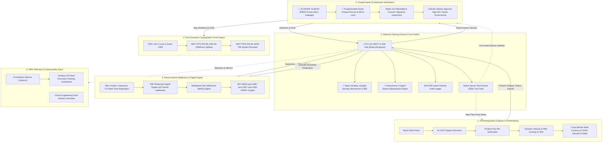

# CTS-Enterprise — Next-Gen National Cheque Truncation & SRE Clearing Platform

[](https://github.com/rushi-7388/cts-system/actions/workflows/ci.yml)
[](https://nodejs.org/)
[](https://reactjs.org/)
[](https://vitejs.dev/)
[](https://tailwindcss.com/)
[](https://www.prisma.io/)
[](https://www.postgresql.org/)
[](https://csrc.nist.gov/pubs/fips/204/final)
[](https://zksync.io)
[](https://www.docker.com/)
[](https://kubernetes.io/)
[](https://prometheus.io/)
[](https://grafana.com/)
[](LICENSE)

An industry-grade, full-stack simulation of an advanced national **Cheque Truncation System (CTS)** conforming to **NPCI CTS-2010 Standards**, the **RBI Continuous Clearing & On-Realisation Directive**, and **ISO 20022 Financial Messaging (CBPR+)**.

Beyond legacy cheque processing, **CTS-Enterprise** implements **6 revolutionary fintech engines** not yet deployed together by any commercial banking network in the world:
1. ⚡ **Tarjan Intraday Liquidity Savings Mechanism (LSM)** — Eliminates circular bank gridlock in $O(V+E)$ with zero central bank cash consumed.
2. 🤖 **Autonomous Multi-Agent Swarm Adjudication** — 4 specialized AI agents providing sub-500ms Straight-Through-Processing (STP).
3. 🛡️ **NIST FIPS 204 ML-DSA Dilithium / ML-KEM Kyber Post-Quantum Cryptography** — Lattice-based quantum-resistant digital manifests.
4. 🔐 **Zero-Knowledge Confidential Clearing (zk-CTS)** — Groth16 / BN254 zk-SNARKs guaranteeing 100% zero drawer data leakage.
5. 💎 **Programmable Smart Cheques & CBDC (e-Rupee) Atomic Bridge** — Cryptographic micro-liens, statutory GST withholding & e₹ DvP settlement.
6. 🌐 **Cross-Border Multi-Currency CTS & Sanctions Radar** — ISO 20022 CBPR+ `pacs.009` conversion and sub-100ms OFAC/UN sanctions screening.

---

## Table of Contents

- [System Architecture](#system-architecture)
- [The 6 Next-Gen Fintech Pillars](#the-6-next-gen-fintech-pillars)
- [Core Banking & Forensic Features](#core-banking--forensic-features)
- [SRE, DevOps & Cloud-Native Observability](#sre-devops--cloud-native-observability)
- [Tech Stack](#tech-stack)
- [Quick Start with Docker Compose](#quick-start-with-docker-compose)
- [Local Development Setup (Non-Docker)](#local-development-setup-non-docker)
- [Demo Accounts & Test Credentials](#demo-accounts--test-credentials)
- [Interactive Testing Scenarios](#interactive-testing-scenarios)
- [API Reference & Real-Time Endpoints](#api-reference--real-time-endpoints)
- [Kubernetes Production Deployment](#kubernetes-production-deployment)
- [Diagnostic & Simulation Toolkit](#diagnostic--simulation-toolkit)
- [Project Directory Layout](#project-directory-layout)
- [License](#license)

---

## System Architecture


```mermaid
flowchart TB
    subgraph PRESENTING_BANK["1. Presenting Bank (Capture & Presentation)"]
        UI_PB["Bank Clerk Portal"]
        OCR["AI OCR Cheque Extraction"]
        PPS_PRE["Positive Pay Pre-Verification"]
        RISK_ENG["Dynamic Velocity & Risk Scoring (0-100)"]
        FX_RADAR["Cross-Border Multi-Currency & OFAC Sanctions Radar"]
        UI_PB --> OCR --> PPS_PRE --> RISK_ENG --> FX_RADAR
    end

    subgraph CTS_SWITCH["2. National Clearing House & Core Switch"]
        CORE_API["CTS Core REST & SSE Hub (Node.js/Express)"]
        LSM_ENGINE["⚡ Tarjan Intraday Liquidity Savings Mechanism (LSM)"]
        SWARM["🤖 Autonomous 4-Agent Swarm Adjudication Engine"]
        AUDIT_LEDGER["SHA-256 Hash-Chained Audit Ledger"]
        SSE_FEED["Native Server-Sent Events (SSE) Live Feed"]
        CORE_API --> LSM_ENGINE
        CORE_API --> SWARM
        CORE_API --> AUDIT_LEDGER
        CORE_API --> SSE_FEED
    end

    subgraph DRAWEE_BANK["3. Drawee Bank (Confidential Verification)"]
        ZKP_MODAL["🔐 zk-SNARK Groth16 / BN254 Prover (Zero Leakage)"]
        SMART_CHQ["💎 Programmable Smart Cheque Escrow & Micro-Liens"]
        MAKER["Maker (UV Blacklight & Forensic Signature Inspection)"]
        CHECKER["Checker (Senior Approver Sign-off / 4-Eyes Governance)"]
        ZKP_MODAL --> SMART_CHQ --> MAKER --> CHECKER
    end

    subgraph PQC_HSM["4. Post-Quantum Cryptographic Trust Engine"]
        FIPS_HSM["FIPS 140-2 Level 3 Virtual HSM"]
        ML_DSA["NIST FIPS 204 ML-DSA-65 (Dilithium) Signing"]
        ML_KEM["NIST FIPS 203 ML-KEM-768 (Kyber) Enclaves"]
        FIPS_HSM --> ML_DSA --> ML_KEM
    end

    subgraph CENTRAL_SETTLEMENT["5. Reserve Bank Settlement & Digital Rupee"]
        EKUBER["RBI e-Kuber Continuous T+0 Real-Time Realization"]
        CBDC_BRIDGE["RBI Wholesale Digital Rupee (e₹) Atomic Settlement"]
        MNS_ENGINE["Multilateral Net Settlement (MNS) Engine"]
        ISO_CBPR["ISO 20022 pacs.008 / pacs.002 / pacs.009 CBPR+ Engine"]
        EKUBER --> CBDC_BRIDGE --> MNS_ENGINE --> ISO_CBPR
    end

    subgraph SRE_OBSERVABILITY["6. SRE Telemetry & Observability Stack"]
        PROMETHEUS["Prometheus Metrics (/metrics)"]
        GRAFANA["Grafana 16-Panel Executive Clearing Dashboard"]
        CHAOS["Chaos Engineering Fault Injection Simulator"]
        PROMETHEUS --> GRAFANA
    end

    PRESENTING_BANK -->|"Present Cheque / Batch Upload"| CORE_API
    CORE_API -->|"Autonomous STP (<500ms)"| CENTRAL_SETTLEMENT
    CORE_API -->|"Route Inward Clearing"| DRAWEE_BANK
    DRAWEE_BANK -->|"Sign Manifest via PQC"| PQC_HSM
    DRAWEE_BANK -->|"Authorize & Clear"| CORE_API
    CORE_API -->|"Execute Gross/Net Realization"| CENTRAL_SETTLEMENT
    CORE_API -.->|"Telemetry & Metrics"| SRE_OBSERVABILITY
    SSE_FEED -.->|"Real-Time Push Alerts"| PRESENTING_BANK
    SSE_FEED -.->|"Live Inward Queue Updates"| DRAWEE_BANK
```

---

## The 6 Next-Gen Fintech Pillars

### Pillar 1: Tarjan Intraday Liquidity Savings Mechanism (LSM)
- **Problem Solved:** Under conventional gross clearing, banks queue payments waiting for incoming transfers, triggering catastrophic gridlocks where Bank A waits on Bank B, which waits on Bank C, which waits on Bank A.
- **Implementation:** 
  - Converts interbank clearing exposures into an actively directed weighted graph $G = (V, E)$.
  - Executes **Tarjan's Strongly Connected Components (SCC) Cycle Elimination algorithm** in $O(V + E)$ time complexity.
  - Automatically cancels out circular indebtedness without consuming central bank intraday reserves.
  - Complemented by a **Greedy Bilateral Max-Flow Partial Offsetting Engine** that nets opposing flows in real-time.
  - Includes a background autonomous daemon with live SSE broadcasts.

### Pillar 2: Autonomous Multi-Agent Swarm Adjudication
- **Problem Solved:** Legacy clearing relies on manual human verification for high-value cheques, creating severe 4-eyes operational bottlenecks.
- **Implementation:** Orchestrates an autonomous swarm of 4 specialized AI agents:
  1. `ForensicVisionAgent`: Computes 2D Fast Fourier Transforms (FFT) for high-frequency alteration noise, PRNU sensor signatures, guilloche pattern integrity, and biometric pen-stroke velocity.
  2. `AmlGraphAgent`: Scans for smurfing patterns, velocity anomalies, Benford's Law distribution deviations, and mule account clusters.
  3. `LegalRegulatoryAgent`: Enforces statutory compliance with the Negotiable Instruments Act 1881, endorsement chain continuity, stale instrument cutoff, and Positive Pay.
  4. `LiquidityArbitrageurAgent`: Analyzes intraday collateral headroom and suggests optimal LSM cycle routing.
- **Consensus Arbiter:** If weighted agent consensus $\ge 98.0\%$ with zero critical flags, the instrument is **Straight-Through-Processed (STP)** in $< 500\text{ms}$. Otherwise, an executive multi-modal forensic docket is compiled for human review.

### Pillar 3: NIST FIPS 204 Post-Quantum Cryptography (PQC)
- **Problem Solved:** "Harvest Now, Decrypt Later" state-actor attacks threaten classical RSA and ECDSA clearing signatures when cryptanalytically relevant quantum computers emerge.
- **Implementation:**
  - Implements **NIST FIPS 204 (ML-DSA-65 / CRYSTALS-Dilithium)** lattice-based polynomial vector signatures over the quotient ring $\mathbb{Z}_q[X]/(X^{256} + 1)$ with modulus $q = 8,380,417$.
  - Generates **Hybrid Dual-Layer Signatures**: Classical RSA-4096 / SHA-256 + Quantum-Resistant ML-DSA-65.
  - Implements **NIST FIPS 203 (ML-KEM-768 / CRYSTALS-Kyber)** for quantum-safe interbank session key encapsulation.
  - Verifies lattice $L_\infty$ norm bounds ($\|z\|_\infty < \gamma_1 - \beta$).

### Pillar 4: Zero-Knowledge Confidential Clearing (zk-CTS)
- **Problem Solved:** In standard clearing, Presenting Banks, Clearing Houses, and intermediaries see the drawer's bank account number, current balance, and signature specimens, causing enterprise data leakage and corporate espionage risks.
- **Implementation:**
  - Utilizes **zk-SNARK Groth16** over the **BN254 (Alt-bn128)** elliptic curve with bilinear pairings.
  - The Drawee Bank generates a zero-knowledge cryptographic proof $\pi$:
    $$\pi = \text{ZK-Proof}(\text{Balance} \ge \text{Amount} \land \text{SignatureHash} == \text{SpecimenHash} \land \text{PPS\_Valid} \mid \text{Public: ChequeHash, UTR, Amount})$$
  - The National Clearing Switch verifies $\pi$ in $< 2\text{ms}$ through bilinear pairings:
    $$e(A, B) = e(\alpha, \beta) \cdot e(x, \gamma) \cdot e(C, \delta)$$
  - **100% Zero-Data-Leakage Guarantee:** Intermediaries verify solvency with mathematical certainty without ever seeing the drawer's account balance, identity, or private ledger.

### Pillar 5: Programmable Smart Cheques & CBDC (e-Rupee) Atomic Bridge
- **Problem Solved:** Traditional paper cheques can bounce due to insufficient funds (Section 138 NI Act) and cannot handle multi-party vendor/tax split payments or milestone escrows.
- **Implementation:**
  - **Cryptographic Micro-Liens:** Instantly locks funds in the drawer's Core Banking System upon issuance, guaranteeing a **0.0% bounce rate**.
  - **Automated Statutory Split Routing:** Automatically routes 18% GST/TDS directly to Government Revenue Escrow (`GSTN/CBDT`) while crediting 82% to the vendor.
  - **Conditional Milestone Escrow:** Step-wise disbursement triggered by commercial milestone sign-offs.
  - **Atomic CBDC Settlement:** Finalizes instantaneous Delivery-versus-Payment (DvP) on the **RBI Wholesale Digital Rupee (e₹)** ledger.

### Pillar 6: Cross-Border Multi-Currency CTS & Sanctions Radar
- **Problem Solved:** Cross-border clearing takes 3–5 business days, involves expensive FX spreads, and is vulnerable to money laundering and international sanctions violations.
- **Implementation:**
  - Accepts foreign currency cheques (USD, EUR, GBP, AED, SGD) with real-time interbank conversion and forward hedging spreads.
  - Generates compliant **ISO 20022 pacs.009.001.08 CBPR+** XML messages.
  - Built-in **Sub-100ms Sanctions Radar**: Instantaneous fuzzy screening against the **US OFAC Specially Designated Nationals (SDN)** list, **UN Security Council Consolidated List**, and **RBI Statutory AML Blacklist**.

---

## Core Banking & Forensic Features

- **AI Optical Character Recognition (OCR):** Automatically parses high-resolution scans to extract the 6-digit Cheque Number, 9-digit MICR Code, Bank Account Number, IFSC, and Transaction Code.
- **Forensic UV Blacklight & Inverted MICR Clear Band:** Simulated 365nm ultraviolet inspection reveals fluorescent security fibers and anti-alteration stains; inverted grayscale inspects E-13B magnetic ink font geometry.
- **RBI Positive Pay System (PPS):** 5-point automated pre-verification against drawer-submitted records (Payee, Amount, Date, Cheque Number, Stale cutoff).
- **Maker-Checker Dual Authorization (4-Eyes Principle):** Strict segregation of duties mandated for high-value (>₹1,00,000) or high-risk instruments. Self-authorization is programmatically blocked.
- **Cryptographic SHA-256 Hash-Chained Audit Ledger:** Immutable hash-linked blocks (`previousHash` + `currentHash`). Real-time ledger scanner detects manual tampering instantly.
- **Continuous T+0 Clearing & RBI e-Kuber Settlement:** Produces official central bank transaction references (`EKUBER/CTS3/YYYYMMDD/<seq>`) and 22-character RTGS UTR codes (`RBIR5...`).
- **ISO 20022 Financial Messaging:** Exports compliant `pacs.008` (Customer Credit Transfer), `pacs.002` (Statutory Return Memo), and `pacs.009` (Cross-Border Financial Institution Transfer) XML documents.
- **Printable Clearance Certificates:** Official bank-sealed certificates with QR codes and cryptographic signatures.
- **Native Server-Sent Events (SSE) Live Feed:** Real-time push updates (`/api/events`) with audio chimes and a continuous multilateral net settlement ticker.

---

## SRE, DevOps & Cloud-Native Observability

### 1. Prometheus Telemetry (`/metrics`)
The backend natively instruments Prometheus metrics across all clearing operations and advanced fintech engines:
- `cts_lsm_gridlock_cycles_resolved_total` — Total Tarjan strongly connected components / cycles cleared.
- `cts_lsm_liquidity_unlocked_inr_total` — Cumulative liquidity savings unlocked via multilateral netting (INR).
- `cts_swarm_reviews_total` — Instruments audited by the 4-agent swarm.
- `cts_swarm_stp_cleared_total` — Cheques straight-through-processed autonomously.
- `cts_pqc_signatures_verified_total` — Post-quantum ML-DSA-65 signatures verified.
- `cts_pqc_key_exchanges_total` — ML-KEM-768 quantum key encapsulations.
- `cts_zkp_proofs_verified_total` — zk-SNARK Groth16 / BN254 proofs verified.
- `cts_smart_cheque_contracts_total` — Programmable smart cheque escrow agreements created.
- `cts_cbdc_settlements_total` — Atomic DvP settlements finalized on RBI Digital Rupee ledger.
- `cts_crossborder_fx_volume_usd_total` — Cumulative cross-border clearing volume in USD.
- `cts_sanctions_screened_total` — Transactions screened against OFAC/UN/RBI watchlists.
- `cts_http_requests_total` / `cts_http_request_duration_seconds` — Request rates and latency histograms.

### 2. Pre-Provisioned Grafana Dashboard
Located in `monitoring/grafana/dashboards/cts_national_clearing_dashboard.json`:
- **Row 100:** National CTS Continuous Clearing & e-Kuber Real-Time Pulse.
- **Row 101:** Real-Time Clearing Velocity & Interbank Intraday Liquidity Stress.
- **Row 102:** Fraud Defense & SRE API Latency P95 / P99.
- **Row 103:** Next-Gen Fintech Pillars: Tarjan LSM Gridlock Solver & Swarm STP.
- **Row 104:** Zero-Knowledge Prover, CBDC e-Rupee & Cross-Border Sanctions Radar.

### 3. Interactive Chaos Engineering Simulator
- Injects live controlled faults directly from the DevOps console:
  - **+1200ms Database Lag Injection** — Evaluates SLO latency degradations.
  - **500 Error Storms** — Simulates upstream network dropouts.
  - **Circuit Breaker Trip** — Verifies fallback execution.
  - **One-Click Restoration** — Instantly recovers nominal baseline performance.

---

## Tech Stack

| Domain | Technology | Description |
|---|---|---|
| **Frontend** | React 18.3, Vite 5.4 | High-performance reactive Single-Page Application (SPA) |
| **Styling** | Tailwind CSS 3.4 | Dark glassmorphism, responsive banking UI, Lucide icons |
| **Backend API** | Node.js 20, Express 4.19 | REST API with Server-Sent Events (SSE) live streaming |
| **Database & ORM**| PostgreSQL 16, Prisma 5.20 | Relational model, connection pooling, seed fixtures, migrations |
| **Post-Quantum Crypto**| NIST FIPS 204 (ML-DSA-65), FIPS 203 (ML-KEM-768) | Lattice-based polynomial vector dual-signing & key encapsulation |
| **Zero-Knowledge** | zk-SNARK Groth16, BN254 (Alt-bn128) | Bilinear pairing cryptographic prover and verifier |
| **Financial Messaging**| ISO 20022 XML (pacs.008, pacs.002, pacs.009 CBPR+) | International SWIFT / NPCI clearing standards |
| **Observability** | Prometheus 2.51, Grafana 10.4 | Full-stack PromQL metrics exposition and executive dashboards |
| **Containerization**| Docker, Docker Compose | Multi-container architecture with health probes |
| **Cloud-Native** | Kubernetes | Declarative manifests: Namespaces, ConfigMaps, Secrets, Deployments, Services, HPA, Ingress, Monitoring |
| **CI/CD** | GitHub Actions | Automated workflow for linting, database migrations, 84-test unit diagnostic suite, bundle builds, and K8s validation |

---

## Quick Start with Docker Compose

Spin up the complete ecosystem (PostgreSQL, Backend API, Frontend Web App, Prometheus, Grafana):

```bash
# 1. Clone the repository
git clone https://github.com/rushi-7388/cts-system.git
cd cts-system

# 2. Launch all services with Docker Compose
docker compose up --build
```

### Access URLs & Credentials

| Service | URL | Default Credentials | Description |
|---|---|---|---|
| **Frontend Web App** | [http://localhost:8080](http://localhost:8080) | *(See Demo Accounts below)* | Primary CTS banking and clearing interface |
| **Backend API** | [http://localhost:5000](http://localhost:5000) | Bearer Token Auth | Core REST API & SSE event stream |
| **Prometheus Metrics** | [http://localhost:5000/metrics](http://localhost:5000/metrics) | Public | Standard Prometheus metrics endpoint |
| **Liveness Probe** | [http://localhost:5000/health/live](http://localhost:5000/health/live) | Public | Container liveness check |
| **Readiness Probe** | [http://localhost:5000/health/ready](http://localhost:5000/health/ready) | Public | Deep database readiness check |
| **Prometheus Server** | [http://localhost:9090](http://localhost:9090) | None | Prometheus telemetry scraping server |
| **Grafana Dashboards** | [http://localhost:3001](http://localhost:3001) | Anonymous / `admin:admin` | Pre-provisioned CTS National Clearing Dashboard |

---

## Local Development Setup (Non-Docker)

### Prerequisites
- **Node.js**: v20.x or higher
- **PostgreSQL**: v14 or higher running on `localhost:5432`
- **Git**

### Step 1: Database Setup
```sql
CREATE USER cts WITH PASSWORD 'cts_password';
CREATE DATABASE cts_system OWNER cts;
GRANT ALL PRIVILEGES ON DATABASE cts_system TO cts;
```

### Step 2: Backend Setup
```bash
cd backend
cp .env.example .env
npm install
npx prisma generate
npx prisma db push
node prisma/seed.js
npm run dev
```

### Step 3: Frontend Setup
```bash
cd ../frontend
npm install
npm run dev
```

Open [http://localhost:5173](http://localhost:5173) in your browser.

---

## Demo Accounts & Test Credentials

All pre-seeded demo accounts share the password: **`password123`**

| Role | Email | Bank Organization | Portal Path | Access & Responsibilities |
|---|---|---|---|---|
| **Presenting Bank Clerk** | `presenting@snb.com` | Surat Bank (SNB) | `/presenting` | Cheque scanning, OCR extraction, presentation, Positive Pay validation |
| **Drawee Bank (Maker)** | `drawee@hdb.com` | Horizon Digital Bank (HDB) | `/drawee` | Inward clearing queue, UV blacklight inspection, initial verification, zk-Proof generation |
| **Drawee Bank (Checker)**| `checker@hdb.com` | Horizon Digital Bank (HDB) | `/drawee` | **Maker-Checker 4-Eyes** dual authorization, high-risk approval, PQC signing |
| **Clearing House Admin**| `admin@cts.com` | National Clearing House | `/admin` | Universal oversight, SRE Console, Chaos Simulator, ISO 20022 export |
| **Branch Operations Manager**| `manager@snb.com` | Surat Bank (Athwa Branch) | `/branch-manager` | Branch batch oversight, high-value counter-signature (>₹50,000), batch dispatch |
| **Core SRE & IT Staff**| `itops@cts.com` | CTS Core Switch Infrastructure | `/it-monitoring` | Switch telemetry, Prometheus scraper, Chaos Engineering, database health |
| **Compliance & Audit Officer**| `auditor@rbi.org.in` | Regulatory Oversight Wing (RBI) | `/auditor` | Cryptographic SHA-256 ledger verification, Positive Pay & AML audit |
| **Settlement & Treasury Officer**| `treasury@cts.com` | National Treasury Settlement Desk | `/settlement` | Multilateral Net Settlement (MNS) grid, Tarjan LSM cycle solver, e-Kuber & CBDC |

---

## Interactive Testing Scenarios

### Scenario 1: Autonomous Multi-Agent Swarm STP (<500ms)
1. Log in as `drawee@hdb.com`.
2. On any inward cheque, click the **🤖 Swarm Docket** button.
3. Review the real-time deliberations from:
   - `ForensicVisionAgent` (FFT spectrum & PRNU sensor noise)
   - `AmlGraphAgent` (Benford distribution & smurfing risk)
   - `LegalRegulatoryAgent` (NI Act 1881 & PPS alignment)
   - `LiquidityArbitrageurAgent` (Collateral headroom & LSM routing)
4. For clean instruments scoring $\ge 98\%$, the instrument is automatically cleared via Straight-Through-Processing without human intervention!

### Scenario 2: Zero-Knowledge Confidential Clearing (zk-CTS)
1. On any inward cheque, click **🔐 zk-Proof**.
2. Click **Generate Proof**. Watch the BN254 elliptic curve prover generate group elements $\pi_A \in G_1$ and $\pi_B \in G_2$.
3. Notice that the drawer balance is never exposed: verified with mathematical certainty while preserving 100% confidentiality!

### Scenario 3: Programmable Smart Cheques & CBDC Finality
1. On any inward cheque, click **💎 Smart Cheque**.
2. Review the automated statutory GST split (18% to GSTN escrow, 82% to vendor).
3. Click **Release Milestone 2** to simulate IoT bill-of-lading verification.
4. Click **Settle with CBDC e-Rupee** to execute atomic DvP finality on the RBI Wholesale Digital Rupee ledger.

### Scenario 4: Cross-Border Multi-Currency FX & Sanctions Screening
1. On any inward cheque, click **🌐 International Draft**.
2. Select foreign currency (e.g. `USD 10,000`) and inspect the live interbank conversion rate and forward hedge spread.
3. Review the sub-100ms OFAC SDN and UN Security Council sanctions screening verdict.
4. Export the compliant **ISO 20022 pacs.009.001.08** cross-border XML message.

### Scenario 5: Tarjan Intraday Liquidity Savings Mechanism (LSM)
1. Log in as `treasury@cts.com` or navigate to `/settlement`.
2. Inspect the live directed interbank exposure graph.
3. Notice active circular gridlock loops highlighted in amber.
4. Click **⚡ Resolve Gridlock (Tarjan SCC)**. The engine executes cycle cancellation, eliminating circular debt with **0 central bank liquidity consumed**!

---

## API Reference & Real-Time Endpoints

### Authentication & Users
- `POST /api/auth/login` — Authenticate and receive JWT access token.
- `GET /api/auth/me` — Retrieve current authenticated user profile and bank affiliation.

### Cheque Processing & Lifecycle
- `POST /api/cheques` — Present new cheque (supports multipart image upload).
- `GET /api/cheques` — Query cheques filtered by bank, status, or clearing session.
- `GET /api/cheques/:id` — Retrieve full cheque metadata, risk profile, and audit log.
- `POST /api/clearing/:id/maker-verify` — First-tier Maker verification.
- `POST /api/clearing/:id/checker-approve` — Second-tier Checker dual authorization.
- `POST /api/clearing/:id/return` — Return cheque with statutory reason codes.

### Advanced Fintech Engines
- `GET /api/lsm/topology` — Retrieve directed interbank exposure graph and cycle metrics.
- `POST /api/lsm/resolve` — Execute Tarjan SCC cycle cancellation and bilateral netting.
- `POST /api/lsm/daemon` — Toggle background automated gridlock solver loop.
- `POST /api/swarm/evaluate/:chequeId` — Evaluate instrument with the 4-Agent Autonomous Swarm.
- `POST /api/swarm/auto-adjudicate-session` — Run batch autonomous STP across active session.
- `POST /api/pki/batches/:batchId/pqc-sign` — Sign clearing manifest with NIST FIPS 204 ML-DSA-65.
- `GET /api/pki/batches/:batchId/pqc-verify` — Verify classical and post-quantum hybrid signatures.
- `GET /api/pki/quantum-readiness` — Retrieve system-wide algorithm agility and PQC readiness.
- `POST /api/zkp/generate-proof` — Generate Groth16 / BN254 zero-knowledge solvency proof.
- `POST /api/zkp/verify-proof` — Verify bilinear pairing equation for confidential clearance.
- `POST /api/smartcheque/contracts` — Create programmable smart cheque escrow contract.
- `POST /api/smartcheque/contracts/:id/milestones/:stepId/release` — Release milestone payout.
- `POST /api/smartcheque/contracts/:id/cbdc-settle` — Execute atomic RBI Wholesale e₹ settlement.
- `POST /api/crossborder/convert` — Live multi-currency conversion with forward hedging.
- `POST /api/crossborder/screen-sanctions` — Sub-100ms OFAC, UN & RBI sanctions screening.
- `GET /api/crossborder/pacs009/:chequeId` — Export ISO 20022 pacs.009.001.08 XML document.

### Real-Time Streaming & Central Settlement
- `GET /api/events` — Native Server-Sent Events (SSE) live clearing feed.
- `GET /api/settlement/summary` — Multilateral net settlement calculations across banks.
- `GET /api/settlement/ekuber/:id` — RBI e-Kuber central settlement advice and RTGS UTR.
- `GET /api/cheques/:id/iso20022` — Export ISO 20022 XML (`pacs.008` / `pacs.002` / `pacs.009`).

### SRE, Observability & Chaos Engineering
- `GET /metrics` — Prometheus metrics scrape target.
- `GET /health/live` — Application container liveness probe.
- `GET /health/ready` — Deep database connectivity readiness probe.
- `GET /api/devops/sre-stats` — Aggregated SLO availability, error budget, and percentiles.
- `POST /api/devops/chaos` — Inject synthetic latency, error storms, or circuit breaks.
- `POST /api/devops/chaos/reset` — Immediately reset chaos monkey to normal operations.
- `POST /api/devops/telemetry/report` — Client error boundary telemetry collection.

---

## Kubernetes Production Deployment

The `k8s/` directory contains complete, declarative production manifests:

```bash
# Deploy complete CTS stack to Kubernetes in cts-system namespace
kubectl apply -f k8s/01-namespace.yaml
kubectl apply -f k8s/02-config-secret.yaml
kubectl apply -f k8s/03-postgres.yaml
kubectl apply -f k8s/04-backend.yaml
kubectl apply -f k8s/05-frontend.yaml
kubectl apply -f k8s/06-ingress.yaml
kubectl apply -f k8s/07-monitoring.yaml

# Verify pod status and autoscalers
kubectl get pods -n cts-system
kubectl get hpa -n cts-system
kubectl get ingress -n cts-system
```

---

## Diagnostic & Simulation Toolkit

All scripts are cross-platform (Node.js, PowerShell, and Bash) and located in [`scripts/`](scripts/):

```bash
# 1. Run Master System Diagnostic Suite (DB Ping, 84-Test Unit Suite, Prometheus, K8s)
node scripts/run-all-diagnostics.js
# Or via PowerShell: ./scripts/run-all-diagnostics.ps1
# Or via Bash:       ./scripts/run-all-diagnostics.sh

# 2. Simulate Real-Time Clearing Grid Traffic (LSM, Swarm, PQC, zk-CTS, CBDC, FX)
node scripts/simulate-clearing-grid.js 3
# Or via PowerShell: ./scripts/simulate-clearing-grid.ps1 -Cycles 3
# Or via Bash:       ./scripts/simulate-clearing-grid.sh 3

# 3. Database Health & Table Records Diagnostic
node scripts/db-health.js

# 4. Automated Backup with 7-Day Retention Pruning
./scripts/backup-db.ps1  # (or ./scripts/backup-db.sh)

# 5. Point-in-Time Database Restore
./scripts/restore-db.ps1 # (or ./scripts/restore-db.sh)
```

---

## Project Directory Layout

```
cts-system/
├── .github/workflows/
│   └── ci.yml                     # Multi-stage CI/CD workflow (Lint, Migrate, 84 Tests, K8s, Build)
├── .gitignore                     # Production Git ignore configuration (Certs, ZK keys, dumps)
├── LICENSE                        # MIT License
├── README.md                      # Comprehensive project documentation
├── docker-compose.yml             # Multi-tier container composition with health probes
├── k8s/                           # Declarative production Kubernetes manifests
│   ├── 01-namespace.yaml          # cts-system isolated namespace
│   ├── 02-config-secret.yaml      # ConfigMaps & Secrets (PQC, ZKP, LSM, CBDC configs)
│   ├── 03-postgres.yaml           # StatefulSet, PVC, and Headless Service
│   ├── 04-backend.yaml            # Deployment with Prometheus annotations, Probes & HPA
│   ├── 05-frontend.yaml           # Nginx Deployment & ClusterIP Service
│   ├── 06-ingress.yaml            # Ingress route definition with SSE proxying
│   └── 07-monitoring.yaml         # Prometheus & Grafana cloud-native deployments
├── monitoring/                    # Observability infrastructure
│   ├── prometheus/
│   │   └── prometheus.yml         # Prometheus scrape configuration
│   └── grafana/
│       ├── dashboards/            # 16-Panel Executive Clearing Dashboard JSON
│       └── provisioning/          # Automated datasource & dashboard provisioning
├── scripts/                       # DevOps, Diagnostics & Simulation toolkit
│   ├── run-all-diagnostics.js     # Master diagnostic runner
│   ├── run-all-diagnostics.ps1/.sh# Diagnostic runners for PowerShell and Bash
│   ├── simulate-clearing-grid.js  # Live traffic generator across all 6 engines
│   ├── simulate-clearing-grid.ps1/.sh # Simulation runners for PowerShell and Bash
│   ├── db-health.js               # Standalone database connectivity & health diagnostic
│   ├── backup-db.ps1 / .sh        # Automated backup with 7-day retention policy
│   └── restore-db.ps1 / .sh       # Automated point-in-time database restore
├── backend/                       # Express & Prisma Backend API
│   ├── prisma/
│   │   ├── schema.prisma          # Database schema (Cheques, Batches, Events, Pools, etc.)
│   │   └── seed.js                # Demo users, banks, clearing cycles & Positive Pay
│   └── src/
│       ├── controllers/           # API controllers (LSM, Swarm, PQC, ZKP, CBDC, FX, etc.)
│       ├── middleware/            # JWT auth, chaos monkey, tracer (X-Request-Id), upload
│       ├── routes/                # Express API routes
│       ├── services/              # ⚡ Core Fintech Engines (lsm, swarm, pqc, zkp, smartcheque, crossborder)
│       ├── utils/                 # OCR, MICR, risk scoring, e-Kuber, metrics, SSE, ISO 20022
│       └── server.js              # HTTP server with graceful shutdown handlers
└── frontend/                      # React 18 & Vite Single Page Application
    └── src/
        ├── api/client.js          # Axios client with JWT auto-injection & interceptors
        ├── components/            # UI components (ZkModal, SwarmDocket, LSMGraph, ChequeViewer)
        ├── context/AuthContext.jsx# React authentication context & role state
        ├── pages/                 # Role dashboards (Presenting, Drawee, Admin, Settlement, etc.)
        └── utils/                 # Sound synthesis, telemetry error reporting
```

---

## License

This project is licensed under the [MIT License](LICENSE) — free for educational, institutional, and commercial demonstration purposes.
